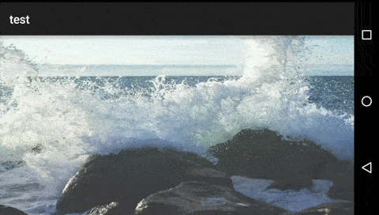

# Fullscreen background slideshow [](http://www.appcelerator.com/titanium/) [](http://www.appcelerator.com/alloy/)

Fullscreen background slideshow with blending images

## Preview


## Quick Start

### Get it [](http://gitt.io/component/com.miga.slideshow)
Download this repository and install it:

* In your application's config.json file, include the following line in your dependencies:

```json
"dependencies": {
    "com.miga.slideshow": "1.0"
}
```

*  Copy the `com.miga.slideshow` folder into your `app/widgets` directory.


**Or simply use the [gitTio CLI](http://gitt.io/cli)**:

`$ gittio install com.miga.slideshow`

### Use it

### xml
~~~
<Widget src="com.miga.slideshow" id="slideshow"/>
~~~

### controller

```javascript
$.slideshow.init({
    images: ["/images/1.jpg","/images/2.jpg","/images/3.jpg"],
    time: 5000
})

$.slideshow.start();
$.slideshow.pause();
$.slideshow.resume();
```

## Documentation
## Public methods
| Method         | Description               |
| -------------  | ------------------------- |
| init | set images and time                       |
| start | start slideshow                       |
| pause | pause slideshow                       |
| resume | resume slideshow                       |


## TODO / Ideas for improvement
Feel free to improve this widget by forking, submitting pull requests or creating issues.  
## Changelog
* 1.0 First version


## Licences
This project is licensed under CC BY-SA 4.0. Please read the https://creativecommons.org/licenses/by-sa/4.0/ for more information about this license.  


Appcelerator, Appcelerator Titanium and associated marks and logos are trademarks of Appcelerator, Inc.  
Titanium is Copyright (c) 2008-2015 by Appcelerator, Inc. All Rights Reserved.  
Titanium is licensed under the Apache Public License (Version 2).  
